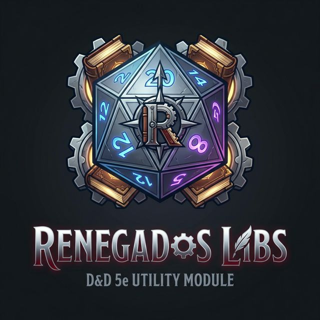

  
  <h1>🎲 Renegados Libs</h1>
  
<strong>O motor por trás do Compêndio dos Renegados!</strong>

  
<em>Um módulo essencial para garantir que a sua mesa de D&D 5e no Foundry VTT rode lisa e sem dores de cabeça com dependências.</em>

---

## 🐲 Sobre o Módulo

O **Renegados Libs** é uma biblioteca de suporte desenvolvida exclusivamente para atuar em conjunto com o nosso Compêndio Privado dos Renegados.

Como o nosso compêndio principal contém muitas automações avançadas e não é distribuído publicamente, este módulo atua como a "**ponte perfeita**". Ele garante que, ao ser instalado, o seu mundo do Foundry VTT faça o download e ative instantaneamente todas as ferramentas pesadas que as nossas fichas e monstros precisam para funcionar.

Chega de jogadores com habilidades quebradas porque esqueceram de instalar um módulo!

## ✨ Por que ele é essencial? (Features)

- 🔗 **Garantia de Dependências**: Instala e exige automaticamente os pilares da nossa automação: `Midi-QoL`, `DAE`, `Times Up`, `Socketlib`, `LibWrapper` e o `Babele`. Se o Renegados Libs está no mundo, o compêndio vai funcionar.
- ⚙️ **Configuração Automática (Auto-Setup)**: Esqueça ter que ir nas configurações do D&D 5e e apontar fonte por fonte pro nosso compêndio. O módulo sobrescreve as configurações de fonte padrão e os dicionários do Babele automaticamente.
- 🇧🇷 **100% Localizado e Convertido**: Suporte nativo para Português Brasileiro (pt-BR) e Inglês (en), se integrando perfeitamente a interface do seu Foundry, além de nossos algoritmos de conversão automática de distâncias.
- 🚀 **Performance Focada**: É puro, direto e feito para não pesar ou lagar seu jogo enquanto faz todo esse trabalho.

---

  
<em>Feito de mestre para mestres da comunidade Renegados. Rolem iniciativa! 🎲</em>

